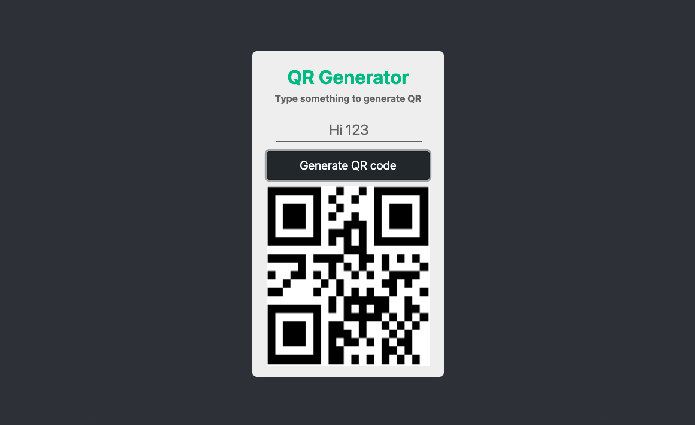

# QR Code Generator
A Simple QR code generator.

# How to use?
Easy, just open the index.html file and you will see the following screen:

Write something and press the button, the QR code corresponding to what you wrote will be generated. 

You can verify the code information with a QR reader, for example:

https://play.google.com/store/apps/details?id=com.teacapps.barcodescanner&hl=es_419&gl=US
